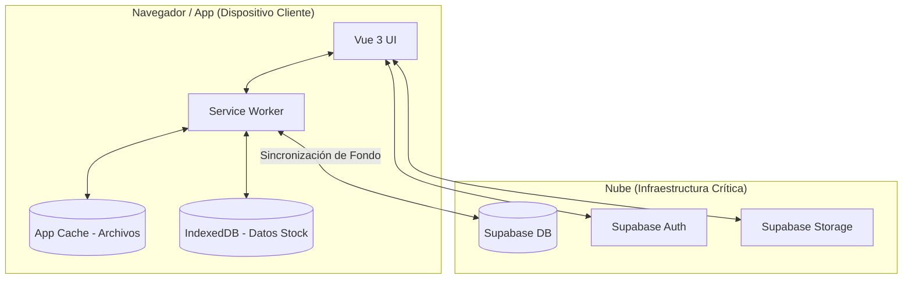
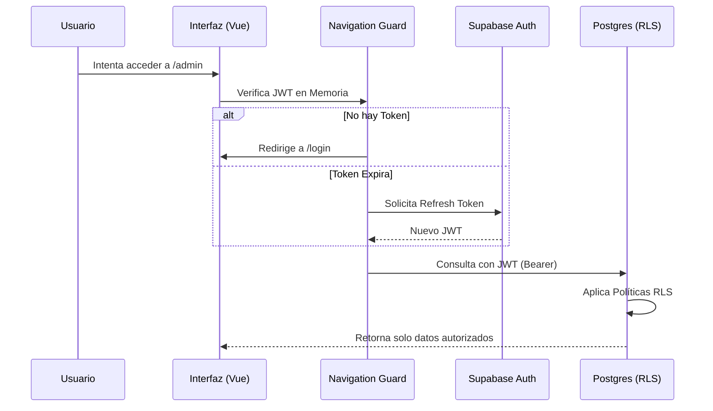
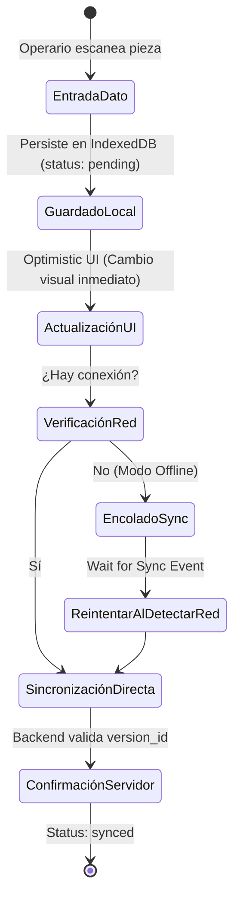
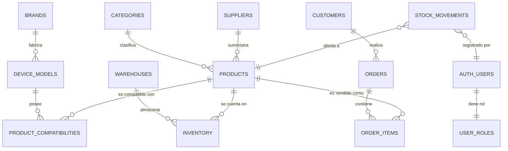

# 🏛️ BLUEPRINT ARQUITECTÓNICO: StockMgr Master System (Estructura Full Stack)

Este documento es el **Plano Maestro Técnico** de StockMgr. Define la arquitectura, infraestructura, capas de seguridad y estándares de desarrollo. Si un ingeniero nuevo entra al proyecto, este es el documento que debe leer para conocer hasta el último tornillo del sistema.

---

## 🏗️ 1. Identificación e Infraestructura (Cimentación)

| Recurso | Proveedor | Detalles Técnicos |
| :--- | :--- | :--- |
| **Repositorio Central** | GitHub | Control de versiones con protección de rama `main`. |
| **Base de Datos** | Supabase (PostgreSQL 15+) | Project Ref: `szmqukqunofeofcfdjod` |
| **Servicio de Autenticación** | Supabase Auth (GoTrue) | Protocolo JWT con Refresh Tokens. |
| **Motor de Compilación** | Vite 6+ | Generación de Assets optimizados y HMR. |
| **Plataforma de Despliegue** | PWA (Progressive Web App) | Instalable en Android, iOS y Windows. |

### `Esquema de Conectividad (Arquitectura PWA)`


---

## 🛠️ 2. Stack Tecnológico (Materiales de Construcción)

- **Lenguaje Core:** TypeScript (Tipado estricto para modelos de datos).
- **Framework Frontend:** Vue 3 (Composition API).
- **Estado Global:** Pinia (Store centralizado).
- **Enrutado:** Vue Router (Guards de seguridad).
- **Estándares de Código:** Biome (Linting & Formatting).
- **Base de Datos Offline:** IndexedDB.

---

## 🛡️ 3. Capas de Seguridad (Blindaje del Edificio)

### `Flujo de Acceso y Seguridad de Datos`


---

## 📱 4. Estrategia PWA y Resiliencia

### `Ciclo de Vida de una Transacción (Sync Offline)`


---

## 🗄️ 5. Modelo de Datos (Esquema Maestro / 15 Tablas)

---

### `Diagrama Entidad-Relación (Relaciones de la DB)`


---

## 📂 6. Estructura del Proyecto (Planos del Diseño)

```text
/
├── .agent/              # Especialistas y reglas de IA
├── docs/                # Documentación maestra y manuales
├── supabase/            # Migraciones SQL y configuración
├── src/                 # Código fuente
│   ├── components/      # UI Atómica (Botones, Inputs)
│   ├── views/           # Páginas (Dashboard, Inventory)
│   ├── modules/         # Lógica (Auth, API, Stock)
│   ├── router/          # Enrutador y Guards
│   └── types/           # Interfaces TS (Source of Truth)
└── public/              # Assets PWA (Icons, Manifest)
```

---

## 📈 7. Visión de Negocio (El Edificio Terminado)

- **Escalabilidad:** Soporta múltiples almacenes y tienda online simultánea.
- **Trazabilidad:** Inmutabilidad de movimientos de stock.
- **Automatización:** Reorden inteligente basado en `safety_stock`.

---

*Este Blueprint es el documento de referencia final. Ante cualquier duda sobre el código, consulte este mapa.*
