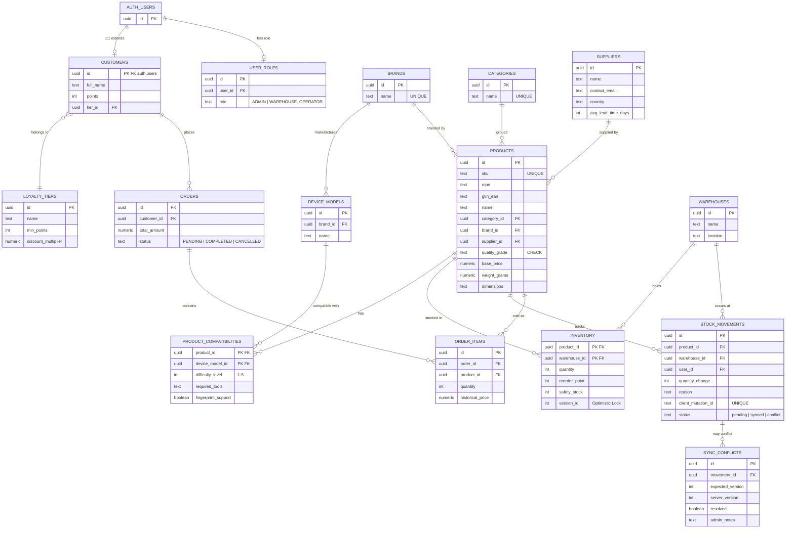

# 📋 INFORME CTO: Arquitectura de Base de Datos Empresarial

**Proyecto:** StockMgr PWA — Gestión de Inventario de Refacciones Móviles
**Emitido por:** CTO (Antigravity Orchestrator)
**Agentes involucrados:** `database-architect`, `supabase-postgres-best-practices`, `c4-architecture`
**Fecha:** 2026-03-02

---

## 1. Resumen Ejecutivo

Se han analizado cruzadamente 6 fuentes técnicas: la propuesta del Arquitecto de DB (`Database Schema.md`), la Guía Técnica PWA/Identity y 4 documentos de investigación de NotebookLM. Este informe consolida las conclusiones y presenta la **arquitectura definitiva** para Supabase.

> [!IMPORTANT]
> La base de datos del prototipo (IndexedDB/Dexie) queda **oficialmente descartada**. Se parte de cero en Supabase con un esquema empresarial normalizado a 3NF.

---

## 2. Análisis Cruzado de Fuentes

### 2.1 Coincidencias (Consenso entre fuentes)
| Aspecto | Database Schema | NotebookLM | Veredicto CTO |
|:---|:---|:---|:---|
| UUIDs como PK | ✅ | ✅ | **Adoptado** |
| SKU como `text` (no numérico) | ✅ | ✅ | **Adoptado** — evita pérdida de ceros |
| Tabla Pivote M:N (Compatibilidad) | ✅ | ✅ | **Adoptado** — con PK compuesta |
| RLS habilitado en todas las tablas | ✅ | — | **Adoptado** — Zero Trust |
| `quality_grade` con CHECK constraint | ✅ | ✅ | **Adoptado** — OEM, Service Pack, Aftermarket, Ori, Refurbished |
| Tabla `stock_movements` para auditoría | ✅ | ✅ | **Adoptado** |

### 2.2 Gaps Detectados (Campos/tablas faltantes en el Schema del Arquitecto)

| Gap | Fuente de Origen | Impacto | Acción del CTO |
|:---|:---|:---|:---|
| **`MPN`** (Manufacturer Part Number) | `[NB] Especificación Técnica` | Alto — Interoperabilidad con proveedores | **AÑADIR** a `products` |
| **`GTIN/EAN`** (Código de barras internacional) | `[NB] Especificación Técnica` | Alto — Logística global e importaciones | **AÑADIR** a `products` (Opcional para genéricos) |
| **`weight` y `dimensions`** | `[NB] Manual Operativo` | Medio — Cálculo de envíos | **AÑADIR** a `products` |
| **Tabla `suppliers`** (Proveedores) | `[NB] Arquitectura E-commerce` | Alto — Trazabilidad de suministro | **CREAR** tabla nueva |
| **`version_id`** (Bloqueo Optimista) | `Guía Técnica PWA Identity` | Crítico — Sincronización offline | **AÑADIR** a `inventory` |
| **Tabla `sync_conflicts`** | `Guía Técnica PWA Identity` | Crítico — Resolución de conflictos offline | **CREAR** tabla nueva |
| **`difficulty_level`** y **`required_tools`** | `[NB] Modelado M:N` | Medio — UX para técnicos de taller | **AÑADIR** a `product_compatibilities` |
| **`fingerprint_support`** (boolean) | `[NB] Modelado M:N` | Medio — Validación pantallas Aftermarket | **AÑADIR** a `product_compatibilities` |
| **`Refurbished`** en quality_grade | `[NB] Manual Operativo` | Bajo — Ampliación de catálogo | **ACTUALIZAR** CHECK constraint |
| **Tabla `user_roles`** (RBAC) | `Guía Técnica PWA Identity` | Crítico — Admin vs Operador | **CREAR** tabla nueva |

### 2.3 Tablas de E-Commerce (Futuro — No activas ahora)
Las siguientes tablas se crean **ahora** pero no se utilizarán hasta la fase de venta online:
- `customers` — Perfil del comprador
- `loyalty_tiers` — Niveles de fidelización (Bronce, Plata, Oro)
- `orders` — Cabecera de pedidos
- `order_items` — Detalle de pedidos con precio histórico

---

## 3. Arquitectura Definitiva: 16 Tablas

### Diagrama Entidad-Relación (Mermaid)



---

## 4. Decisiones Arquitectónicas Clave

1. **`version_id` en Inventory:** Implementa Bloqueo Optimista para sincronización offline. Cuando el operador actualiza stock sin conexión, el servidor compara versiones antes de aceptar el cambio.
2. **`client_mutation_id` en Stock Movements:** Cada movimiento offline recibe un ID único del cliente para garantizar idempotencia (evitar duplicados al reconectar).
1. **Estandarización de SKU (Opción B Equilibrada):** Implementa bloques fijos separados por guiones con un correlativo global de 5 dígitos (`CAT-MAR-ES-CON-00001`). Esto permite identificar cada producto de forma única (hasta 100k registros) manteniendo una lectura humana ágil y limpia.
4. **`user_id` en Stock Movements:** Cada movimiento queda atribuido al operador que lo realizó, habilitando auditorías completas.
5. **CHECK ampliado en `quality_grade`:** Se añade `'Refurbished'` al constraint original para cubrir los 5 niveles documentados en NotebookLM.

---

## 5. Índices de Rendimiento Recomendados

```sql
-- Búsqueda rápida por SKU, MPN y código de barras
CREATE INDEX idx_products_sku ON products(sku);
CREATE INDEX idx_products_mpn ON products(mpn);
CREATE INDEX idx_products_gtin ON products(gtin_ean);

-- Compatibilidad bidireccional rápida
CREATE INDEX idx_compat_product ON product_compatibilities(product_id);
CREATE INDEX idx_compat_device ON product_compatibilities(device_model_id);

-- Movimientos e inventario
CREATE INDEX idx_movements_product ON stock_movements(product_id);
CREATE INDEX idx_inventory_product ON inventory(product_id);
CREATE INDEX idx_orders_customer ON orders(customer_id);

-- Idempotencia offline
CREATE UNIQUE INDEX idx_movements_mutation ON stock_movements(client_mutation_id);
```

---
*Informe generado por el CTO Orchestrator de Antigravity para revisión del Lead Developer.*
