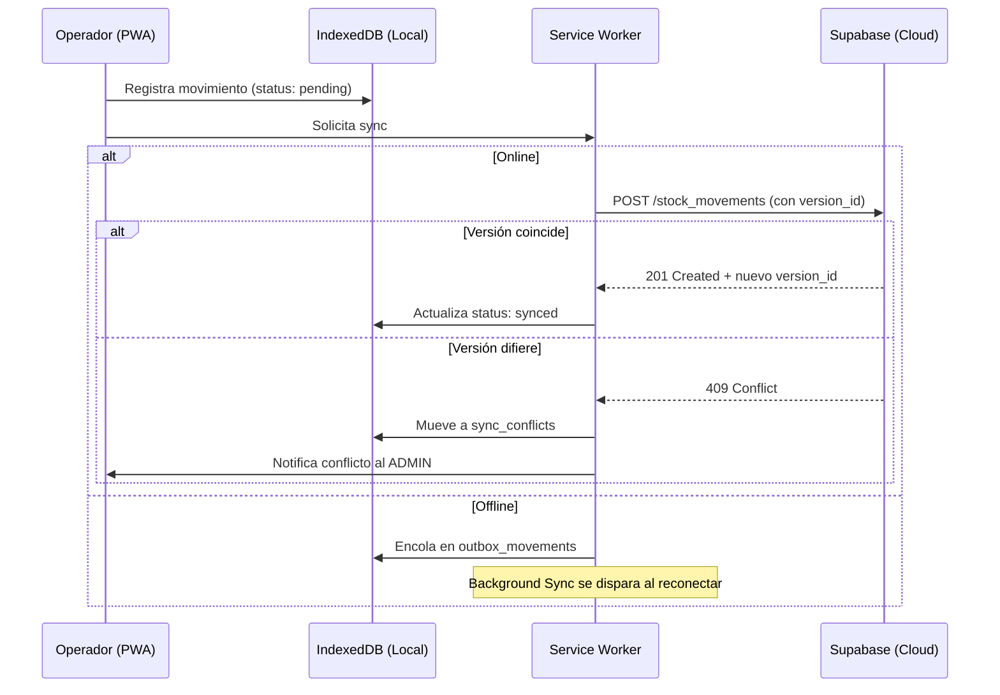

# 🛡️ INFORME DE SEGURIDAD: Identity, Auth y Protección de Datos

**Proyecto:** StockMgr PWA — Módulo de Seguridad y Gestión de Identidad
**Emitido por:** CTO (Antigravity Orchestrator)
**Agentes involucrados:** `project-auditor`, `security-hardening`, `supabase-specialist`
**Fecha:** 2026-03-02

---

## 1. Resumen Ejecutivo

Este informe evalúa los requisitos de seguridad para StockMgr basándose en la `Guía Técnica PWA Stock & Identity` y el esquema RLS propuesto en `Database Schema.md`. Se define la estrategia de autenticación, autorización RBAC, sincronización offline segura y cifrado en reposo.

---

## 2. Arquitectura de Identidad

### 2.1 Autenticación (Supabase Auth)

| Componente | Implementación | Justificación |
|:---|:---|:---|
| **Protocolo** | OAuth 2.0 + OIDC (Supabase Auth nativo) | Estándar de la industria, soportado nativamente |
| **Access Token** | JWT, vida corta (15 min), almacenado en memoria (Pinia Store) | Minimiza ventana de ataque en caso de XSS |
| **Refresh Token** | Cookie `HttpOnly`, `Secure`, `SameSite=Strict` | Supabase lo gestiona automáticamente |
| **MFA (Futuro)** | WebAuthn/FIDO2 para biometría en dispositivos móviles | No bloqueante para la Fase 1. Se implementará con Supabase MFA |

### 2.2 Autorización (RBAC — Role-Based Access Control)

Se definen **2 roles** para la PWA:

| Rol | Permisos DB | Permisos UI |
|:---|:---|:---|
| **`ADMIN`** | CRUD completo en todas las tablas. Puede resolver `sync_conflicts`, gestionar usuarios, ver reportes financieros | Acceso total: Dashboard, Inventario, Catálogo, Configuración, Usuarios. Incluye panel de gestión de permisos granular para activar/desactivar acciones por trabajador (por defecto deshabilitado). |
| **`WAREHOUSE_OPERATOR`** | SELECT en catálogo. INSERT en `stock_movements`. UPDATE en `inventory` (solo cantidad). Sin acceso a `orders`, `customers`, `loyalty_tiers` | Acceso limitado: Escáner, Movimientos de Stock, Consulta de Catálogo |

### 2.3 Tabla `user_roles` (Nueva)

```sql
CREATE TABLE public.user_roles (
  id uuid DEFAULT uuid_generate_v4() PRIMARY KEY,
  user_id uuid REFERENCES auth.users(id) ON DELETE CASCADE UNIQUE,
  role text NOT NULL CHECK (role IN ('ADMIN', 'WAREHOUSE_OPERATOR')),
  created_at timestamptz DEFAULT now()
);

ALTER TABLE public.user_roles ENABLE ROW LEVEL SECURITY;

-- Solo el propio usuario puede ver su rol
CREATE POLICY "User sees own role" ON public.user_roles
  FOR SELECT USING (auth.uid() = user_id);

-- Solo ADMIN puede gestionar roles
CREATE POLICY "Admin manages roles" ON public.user_roles
  FOR ALL USING (
    EXISTS (SELECT 1 FROM public.user_roles WHERE user_id = auth.uid() AND role = 'ADMIN')
  );
```

---

## 3. Políticas RLS (Row-Level Security)

### 3.1 Evaluación del Schema Propuesto

| Tabla | Policy Actual | Evaluación | Recomendación |
|:---|:---|:---|:---|
| `products` | SELECT para autenticados | ✅ Correcto | Sin cambios |
| `brands`, `categories`, `device_models` | SELECT para autenticados | ✅ Correcto | Sin cambios |
| `inventory` | SELECT para autenticados | ⚠️ Insuficiente | Añadir UPDATE restringido para WAREHOUSE_OPERATOR |
| `stock_movements` | No definido | 🔴 Faltante | Crear INSERT para operadores + SELECT para ADMIN |
| `customers` | Solo el propio usuario | ✅ Correcto | Sin cambios |
| `orders` / `order_items` | Solo el propio usuario | ✅ Correcto | No activas por ahora |
| `sync_conflicts` | No definido | 🔴 Faltante | Solo ADMIN puede ver y resolver |
| `user_roles` | No definido | 🔴 Faltante | Definido arriba |

### 3.2 Políticas Faltantes (Críticas)

```sql
-- Stock Movements: Operadores pueden insertar, Admin puede ver todo
CREATE POLICY "Operator inserts movements" ON public.stock_movements
  FOR INSERT WITH CHECK (auth.uid() IS NOT NULL);

CREATE POLICY "Admin reads all movements" ON public.stock_movements
  FOR SELECT USING (
    EXISTS (SELECT 1 FROM public.user_roles WHERE user_id = auth.uid() AND role = 'ADMIN')
  );

CREATE POLICY "Operator reads own movements" ON public.stock_movements
  FOR SELECT USING (user_id = auth.uid());

-- Inventory: Operadores pueden actualizar cantidad
CREATE POLICY "Operator updates stock" ON public.inventory
  FOR UPDATE USING (auth.uid() IS NOT NULL)
  WITH CHECK (auth.uid() IS NOT NULL);

-- Sync Conflicts: Solo Admin
CREATE POLICY "Admin manages conflicts" ON public.sync_conflicts
  FOR ALL USING (
    EXISTS (SELECT 1 FROM public.user_roles WHERE user_id = auth.uid() AND role = 'ADMIN')
  );
```

---

## 4. Protocolo de Sincronización Offline

### 4.1 Flujo de Reconciliación



### 4.2 Idempotencia
- Cada movimiento offline recibe un `client_mutation_id` (UUID generado en el cliente).
- El servidor usa un `UNIQUE INDEX` sobre este campo para rechazar duplicados si el sync se dispara dos veces.

---

## 5. Cifrado y Protección de Datos

| Capa | Mecanismo | Estado |
|:---|:---|:---|
| **En tránsito** | HTTPS/TLS (Supabase lo provee por defecto) | ✅ Automático |
| **En reposo (servidor)** | Cifrado AES-256 de Supabase PostgreSQL | ✅ Automático |
| **En reposo (cliente)** | Web Crypto API + AES-GCM sobre IndexedDB | 🟡 Fase futura |
| **Tokens** | HttpOnly Cookies (Refresh), Memory-only (Access) | ✅ Implementado en Auth |
| **Backups** | Cifrado AES-256 con llave maestra en custodia del humano | 🟡 Fase futura |

---

## 6. Recomendaciones de Seguridad Adicionales

1. **No exponer `SERVICE_ROLE_KEY`** jamás en el frontend. Solo debe usarse en edge functions o backend (n8n).
2. **Validar scopes en el Service Worker** para mostrar/ocultar funcionalidades de UI según el rol del usuario.
3. **Rate Limiting:** Implementar limitación de intentos de login (Supabase lo soporta nativamente).
4. **Audit Log:** La tabla `stock_movements` con `user_id` ya actúa como log de auditoría. Considerar añadir `ip_address` en una fase futura.

---
*Informe generado por el equipo de Seguridad (project-auditor + security-hardening) de Antigravity.*
