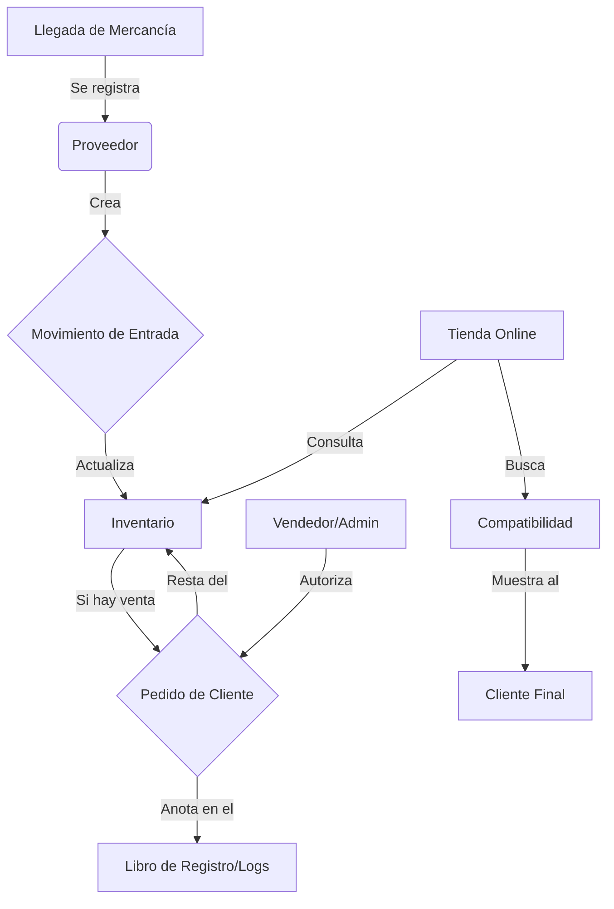

# 📦 Informe Maestro: El Corazón de StockMgr (Estructura de Datos V2)

Este informe describe cómo está organizado el "cerebro" de tu aplicación. Imagina que la base de datos es un archivador inteligente donde cada cajón (**Tabla**) sabe exactamente qué hay en los demás.

---

## 🏛️ 1. Los "Polares" del Inventario (Catálogo / Normalización)

Estas tablas guardan la información fija de lo que vendes. No cambian cada vez que vendes algo, sino que definen *qué* es cada cosa.

| Cajón (Tabla) | ¿Para qué sirve? (Funcionalidad) | ¿Con qué se habla? (Relaciones / Foreign Keys) |
| :--- | :--- | :--- |
| **Productos** | Es la ficha técnica maestra. Guarda el SKU, el nombre y el grado de calidad (**UUID** para identificación única). | Conoce su **Marca**, su **Categoría** y quién es su **Proveedor**. |
| **Marcas** | Un listado de fabricantes (Apple, Samsung, Alcatel). Evita duplicidad de datos (**Normalización**). | Se vincula con los **Modelos de Teléfono**. |
| **Modelos** | La lista de dispositivos específicos (iPhone 13, Galaxy S21). | Sabe a qué **Marca** pertenece (Relación de **Llave Foránea**). |
| **Categorías** | Organiza todo en grupos: Pantallas, Baterías, Pines de Carga, etc. | Clasifica a los **Productos**. |
| **Proveedores**| Información de quién nos surte. Vital para saber a quién reclamar una garantía. | Sabe qué **Productos** nos ha traído. |
| **Compatibilidad**| El "diccionario de piezas". Dice, por ejemplo, que una pantalla específica sirve para 3 modelos distintos. | Une **Productos** con **Modelos de Teléfono**. |

---

## ⚡ 2. El Movimiento Diario (Stock y Almacén / Transaccional)

Aquí es donde ocurre la magia del día a día. Estas tablas cambian cada vez que usas el escáner.

| Cajón (Tabla) | ¿Para qué sirve? (Funcionalidad) | ¿Con qué se habla? (Relaciones / Foreign Keys) |
| :--- | :--- | :--- |
| **Inventario** | El contador en tiempo real. Dice cuántas unidades quedan en cada estante. | Une el **Producto** con el **Almacén**. |
| **Almacenes** | Define tus ubicaciones físicas (Tienda 1, Bodega Central, etc.). | Sabe qué hay en su **Inventario**. |
| **Movimientos** | El libro de registro (**Logs de Transacción**). Anota quién sacó qué, a qué hora y por qué. | Sabe qué **Usuario** hizo el cambio y sobre qué **Producto**. |
| **Conflictos** | El "semáforo de seguridad". Si dos personas usan la app sin internet y luego se conectan, aquí se resuelve quién tiene la razón (**Consistencia de Datos**). | Revisa los **Movimientos** dudosos. |

---

## 👥 3. El Equipo y los Clientes (Identidad / RBAC)

Prepara el terreno para que la aplicación no solo cuente piezas, sino que también venda y gestione personas (**Soberanía de Datos**).

| Cajón (Tabla) | ¿Para qué sirve? (Funcionalidad) | ¿Con qué se habla? (Relaciones / Foreign Keys) |
| :--- | :--- | :--- |
| **Roles de Usuario**| Define quién puede hacer qué. Un operador solo escanea; tú como Admin controlas todo (**RBAC / Control de Acceso**). | Controla el acceso de cada **Usuario**. |
| **Clientes** | Tu base de datos de compradores fieles. Guarda sus puntos y compras. | Se vincula con los **Pedidos**. |
| **Niveles (Loyalty)**| Clasifica a los clientes (Bronce, Plata, Oro) para darles descuentos automáticos. | Define el estatus de los **Clientes**. |
| **Pedidos** | El ticket de venta final. Registra cuánto se cobró y cuándo. | Une al **Cliente** con sus **Artículos comprados**. |

---

## 🔄 El Recorrido de una Pieza (Ciclo de Vida del Dato)

Para visualizar cómo interactúan todos estos "cajones", aquí tienes el flujo de trabajo de un artículo desde que llega hasta que se vende:

---

## 🚀 ¿Qué implica esta estructura para el negocio?

Tener esta organización no es solo "orden"; es lo que hace que StockMgr sea una herramienta profesional y no un simple Excel:

1.  **Venta Online Imparable:** Al tener la **Compatibilidad** bien amarrada, cuando un cliente busque "Pantalla iPhone 13" en la futura tienda online, el sistema solo le mostrará lo que realmente le sirve. Cero errores de compra.
2.  **Inventario sin Errores (Modo Offline):** Gracias a la tabla de **Conflictos y Versiones**, tú puedes estar en el sótano sin señal escaneando cajas, y cuando subas a la oficina, el sistema "coserá" tus cambios con los de los demás sin perder ni una unidad.
3.  **Seguridad Total:** Los **Roles de Usuario** garantizan que nadie vea tus precios de costo o tus beneficios a menos que tú le des la llave maestra.
4.  **Decisiones Inteligentes:** Con el historial de **Movimientos**, sabrás qué se vende más y qué proveedor te está enviando piezas de mala calidad.
