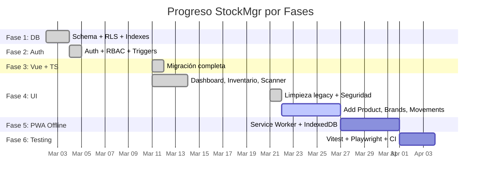

# 📋 Informe de Continuidad — StockMgr
**Fecha:** 2026-03-24 | **Proyecto:** `szmqukqunofeofcfdjod` | **Rama Activa:** `cleanup/legacy-removal`

---

## 1. Estado General del Proyecto

| Aspecto | Estado | Detalle |
|:--------|:-------|:--------|
| **Supabase** | ✅ `ACTIVE_HEALTHY` | PostgreSQL 17.6, región `us-west-2` |
| **Rama Git** | `cleanup/legacy-removal` (HEAD) | 4 commits totales |
| **Stack** | Vue 3.5 + TypeScript + Pinia + Vite 7 | PWA con Service Worker via `vite-plugin-pwa` |
| **DB Schema** | 15 tablas implementadas | Todas con RLS habilitado |
| **Datos** | 0 registros en todas las tablas | Seed data no insertado o limpiado |

---

## 2. Auditoría de Base de Datos (15 Tablas en `public`)

### Módulo Core — Catálogo & Stock
| Tabla | PK | Columnas Clave | RLS |
|:------|:---|:---------------|:----|
| `brands` | UUID | `name` (unique) | ✅ |
| `categories` | UUID | `name` (unique) | ✅ |
| `device_models` | UUID | `brand_id` → brands, `name` | ✅ |
| `products` | UUID | `sku` (unique), `mpn`, `gtin_ean`, `quality_grade` (enum: OEM/Service Pack/Aftermarket/Ori/Refurbished) | ✅ |
| `product_compatibilities` | Compuesta (`product_id`, `device_model_id`) | `difficulty_level` (1-5), `required_tools`, `fingerprint_support` | ✅ |
| `suppliers` | UUID | `name`, `contact_email`, `country`, `avg_lead_time_days` | ✅ |

### Módulo Logística — Inventario & Movimientos
| Tabla | PK | Columnas Clave | RLS |
|:------|:---|:---------------|:----|
| `warehouses` | UUID | `name`, `location` | ✅ |
| `inventory` | Compuesta (`product_id`, `warehouse_id`) | `quantity`, `reorder_point`, `safety_stock`, `version_id` (bloqueo optimista) | ✅ |
| `stock_movements` | UUID | `quantity_change`, `reason`, `client_mutation_id` (unique, anti-duplicado offline), `status` (pending/synced/conflict) | ✅ |
| `sync_conflicts` | UUID | `movement_id`, `expected_version`, `server_version`, `resolved`, `admin_notes` | ✅ |

### Módulo Identity — Roles
| Tabla | PK | Columnas Clave | RLS |
|:------|:---|:---------------|:----|
| `user_roles` | UUID | `user_id` → auth.users, `role` (ADMIN / WAREHOUSE_OPERATOR) | ✅ |

### Módulo CRM — Futuro (tablas creadas, sin UI)
| Tabla | PK | Columnas Clave | RLS |
|:------|:---|:---------------|:----|
| `customers` | UUID (= auth.users.id) | `full_name`, `points`, `tier_id` | ✅ |
| `loyalty_tiers` | UUID | `name`, `min_points`, `discount_multiplier` | ✅ |
| `orders` | UUID | `customer_id`, `total_amount`, `status` (PENDING/COMPLETED/CANCELLED) | ✅ |
| `order_items` | UUID | `order_id`, `product_id`, `quantity`, `historical_price` | ✅ |

---

## 3. Políticas RLS Implementadas (32 políticas activas)

| Patrón | Tablas Cubiertas | Descripción |
|:-------|:-----------------|:------------|
| **Admin ALL** | Todas las 15 tablas | `is_admin()` → control total |
| **SELECT autenticado** | brands, categories, device_models, products, product_compatibilities, suppliers, warehouses, inventory, loyalty_tiers | Cualquier usuario autenticado puede leer datos de catálogo |
| **Operator UPDATE** | `inventory` | `is_operator()` puede actualizar stock |
| **Operator INSERT** | `stock_movements` | `is_operator()` puede registrar movimientos |
| **Operator SELECT own** | `stock_movements` | Operador solo ve sus propios movimientos |
| **Customer own data** | `customers`, `orders`, `order_items` | `auth.uid() = id` / scoped a sus pedidos |

> [!TIP]
> Las funciones auxiliares `is_admin()` e `is_operator()` ya están creadas como helpers RLS.

---

## 4. Estructura de SKU — Formato de 19 Caracteres

```
CAT-MAR-ES-CON-00001
│   │   │  │   └── Correlativo (5 dígitos)
│   │   │  └────── Condición: OEM / SVP / AFT (3 chars)
│   │   └───────── Estado: 01=Nuevo, etc. (2 dígitos)
│   └───────────── Marca: SAM, MOT, XIA... (3 chars)
└───────────────── Categoría: PAN, BAT, FLE... (3 chars)
```

El motor legacy de generación está en [sku-engine.js](file:///c:/Users/3lio/Documents/Proyectos%20Web/Ivan/MercadoLibre/Stock/src/legacy/sku-engine.js) — **pendiente de migración a TypeScript**.

---

## 5. Diccionario de Modelos

Se mantiene un catálogo de **110 modelos de dispositivos** en [Diccionario de Modelos.json](file:///c:/Users/3lio/Documents/Proyectos%20Web/Ivan/MercadoLibre/Stock/Diccionario%20de%20Modelos.json) que cubre:

| Marca | Cantidad de Modelos |
|:------|:---|
| Samsung | ~25 |
| Motorola | ~18 |
| Xiaomi/Redmi | ~16 |
| ZTE | ~10 |
| Huawei | ~7 |
| Honor | ~4 |
| Oppo | ~5 |
| Alcatel | ~5 |
| Otros (Realme, Hisense, Asus, TCL, GoPro, Lenovo, Lanix, Nix, LG) | ~10 |

> [!WARNING]
> Este diccionario aún no ha sido cargado en la tabla `device_models` de Supabase (0 rows). Es una tarea pendiente del Seed Data.

---

## 6. Migraciones Aplicadas (11 migraciones)

| # | Versión | Nombre | Descripción |
|:--|:--------|:-------|:------------|
| 1 | `20260302232455` | `001_core_schema` | Creación de las 15 tablas |
| 2 | `20260302232540` | `002_security_rls` | Políticas RLS + helpers `is_admin()` / `is_operator()` |
| 3 | `20260302232602` | `003_performance_indexes` | Índices de rendimiento |
| 4 | `20260302232639` | `004_seed_data` | Datos semilla iniciales |
| 5 | `20260303002917` | `005_fix_sku_format` | Corrección formato SKU |
| 6 | `20260303010451` | `006_finalize_sku_system_scaled` | SKU escalado |
| 7 | `20260303012210` | `007_final_sku_consensus_5_digits` | Correlativo 5 dígitos |
| 8 | `20260303013101` | `008_security_and_performance_patch` | Parche seg. + rendimiento |
| 9 | `20260304210756` | `fase2_auth_trigger` | Trigger para auto-crear `user_roles` en registro |
| 10 | `20260304210934` | `fase2_reforzar_constraints` | Refuerzo de constraints |
| 11 | `20260311214827` | `fix_handle_new_user_search_path_security` | Fix `search_path` en funciones |

---

## 7. Estado del Frontend (Vue 3 + TypeScript)

### Vistas Implementadas
| Vista | Archivo | Estado |
|:------|:--------|:-------|
| Login | `LoginView.vue` (3KB) | ✅ Con rate limiting (5 intentos / 30s) |
| Dashboard | `Dashboard.vue` (7.5KB) | ✅ KPIs, alertas bajo stock, acceso rápido |
| Inventario | `InventoryView.vue` (5.3KB) | ✅ Filtros, chips de marca, semáforo stock |
| Scanner | `ScannerView.vue` (7.6KB) | ✅ `html5-qrcode`, detección automática |
| Add Product | `AddProductView.vue` (1.4KB) | ⚠️ Placeholder |
| Brands | `BrandsView.vue` (332B) | ⚠️ Placeholder |
| Movements | `MovementsView.vue` (355B) | ⚠️ Placeholder |
| Product Detail | `ProductDetailView.vue` (523B) | ⚠️ Placeholder |
| Profile | `ProfileView.vue` (330B) | ⚠️ Placeholder |

### Stores (Pinia)
| Store | Función |
|:------|:--------|
| `useAuthStore.ts` | Sesión, JWT, roles RBAC |
| `useCatalogStore.ts` | Productos, marcas, catálogo reactivo |
| `useStockStore.ts` | Entrada/salida stock (preparado para offline) |

### Código Legacy (pendiente de migración)
| Archivo | Lógica |
|:--------|:-------|
| `sku-engine.js` | Motor de generación de SKUs de 19 caracteres |
| `add-product.js` | Validaciones de formularios de alta |
| `models.js` | Catálogo de modelos y compatibilidades |
| `crypto.js` | Generador de contraseñas seguras |
| `db.js` | Esquema Dexie para soporte Offline |

---

## 8. Roadmap — ¿Dónde se detuvo el desarrollo?



### 🎯 Punto Exacto de Detención

> **Fase 4 — Tarea 4.5/4.7/4.8 (UI Corporativa)**
> 
> Se completaron: Dashboard, Inventario, Scanner, Login. Se realizó limpieza legacy y primeras medidas de seguridad (rate limiting, validación .env).
>
> **Quedó pendiente:**
> - Fase C de estabilidad (mencionada al final del changelog del 21 de marzo)
> - Vistas funcionales para: Add Product, Brands/Modelos, Movements, Product Detail, Profile
> - Carga del Seed Data real (110 modelos del diccionario + categorías + marcas)

---

## 9. Próximos Pasos Técnicos Recomendados

### 🔴 Prioridad CRÍTICA (Fase 4 restante)
1. **Seed Data real** — Cargar el diccionario de 110 modelos en `device_models`, poblar `brands` y `categories`
2. **Vista AddProduct** — Migrar lógica de `add-product.js` legacy al componente Vue con SKU engine en TS
3. **Vista Brands/Models** — CRUD visual para gestión de marcas y modelos de dispositivos
4. **Vista Movements** — Historial de entradas/salidas con filtros por fecha y producto

### 🟡 Prioridad MEDIA (Fase 4 completar + Fase 5)
5. **Motor SKU en TypeScript** — Migrar `sku-engine.js` → `src/modules/skuEngine.ts`
6. **Product Detail** — Vista con compatibilidades M:N y fotos
7. **Profile View** — Datos de usuario y gestión de sesión
8. **Offline Mode base** — Configurar Dexie.js como caché parcial

### 🟢 Prioridad BAJA (Fase 6+)
9. **Tests unitarios** — SKU engine, stores, sync logic
10. **CI/CD** — Activar `quality.yml` en GitHub Actions
11. **E-Commerce** — Activar lógica de `customers`, `orders`, `loyalty_tiers`

---

> [!IMPORTANT]
> **Todas las tablas tienen 0 registros.** El seed data (migración `004_seed_data`) no parece haber insertado datos persistentes o fueron limpiados. La primera acción antes de continuar con UI debe ser poblar la base de datos con datos reales del diccionario de modelos.
